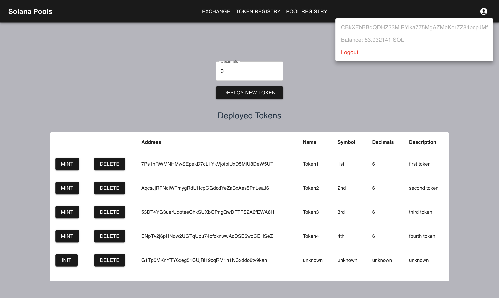
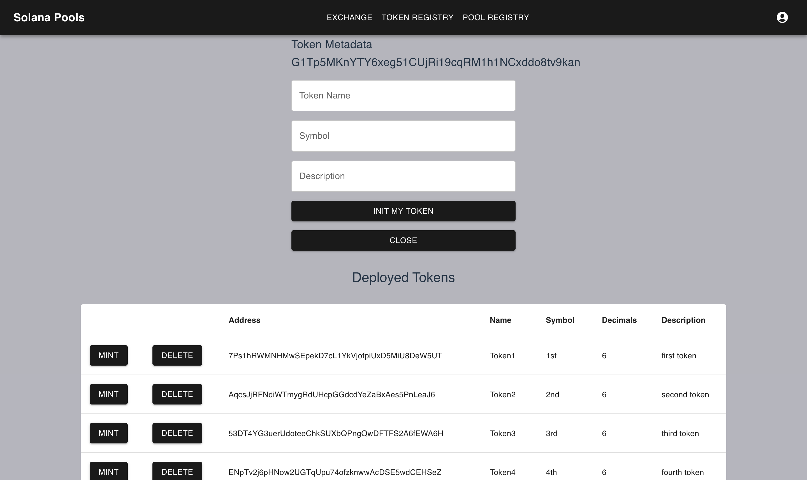
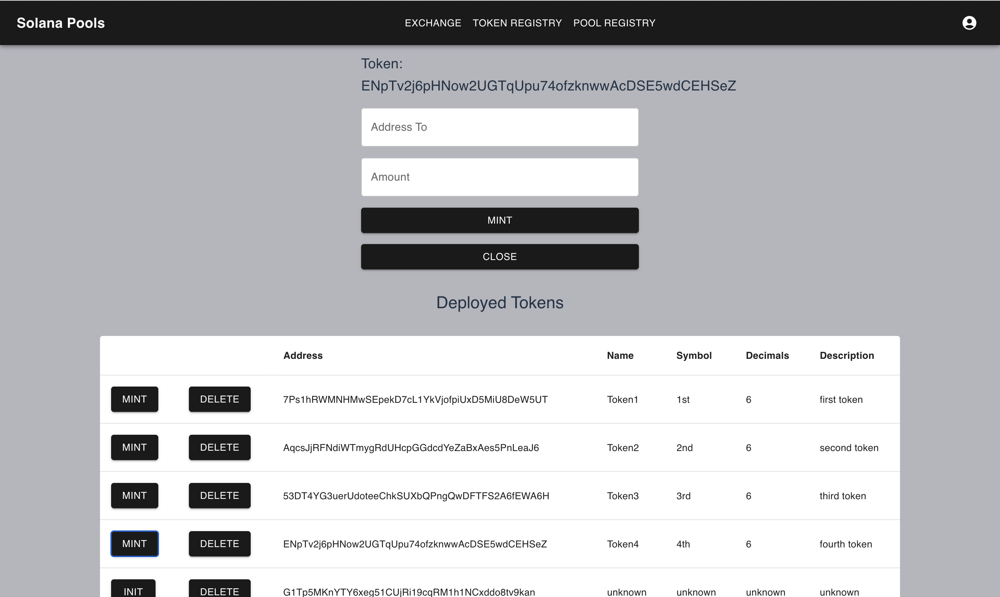
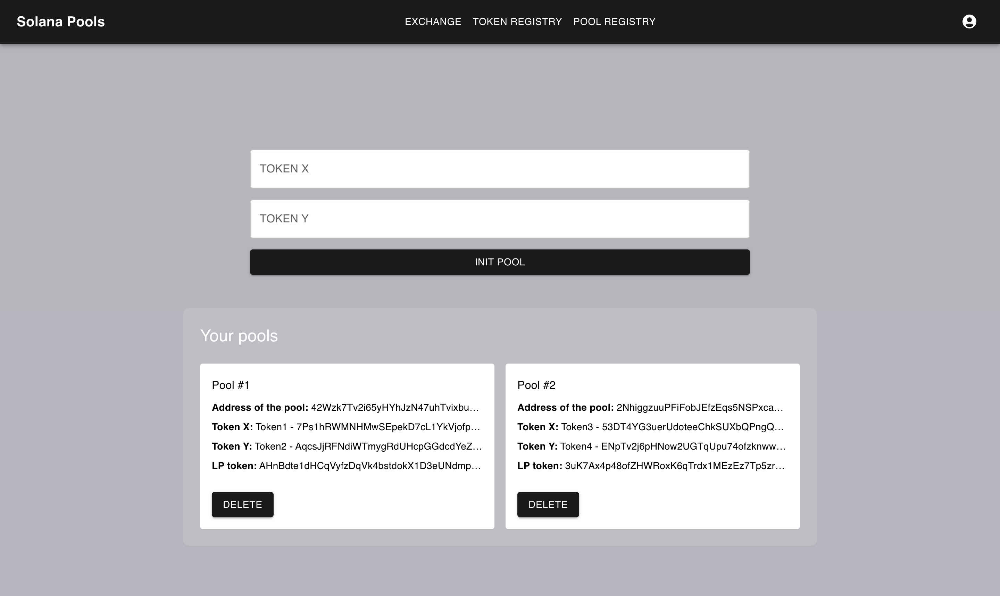
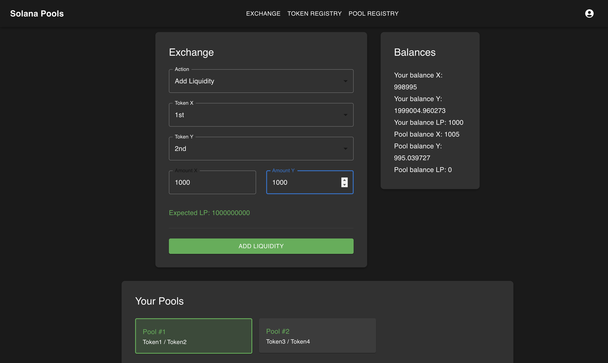
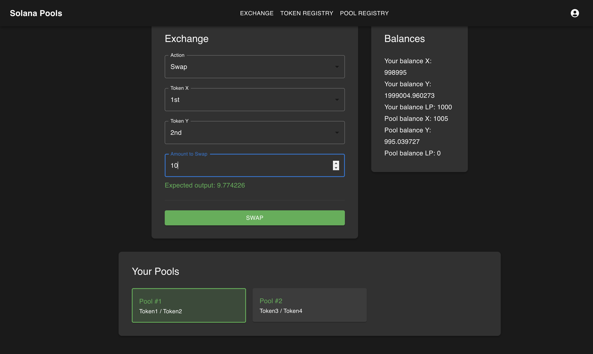

This project is a prototype of the simple Automated Market Maker (AMM) implemented on the Solana blockchain using the Anchor framework.

It was created as a learning exercise to understand Solana smart contracts, how state management works, and how to interact with Solana’s token system.

___

## Not finished: code needs to be refactored and smart-contracts to be improved.

## Overview

This AMM implementation enables users to:

•	Initialize a liquidity pool for two token pairs (Token X and Token Y).
	
•	Add liquidity to the pool in exchange for LP tokens.
	
•	Remove liquidity by redeeming LP tokens.
	
•	Swap tokens (Token X for Token Y and vice versa) using a simple AMM pricing formula (x*y=k).

## Some Interfaces

### 1. Token List

The page to manage the list of the user's tokens.

### 2. Pool List

The page to manage the list of the user's pools.

### 3. Exchange 

The page of the interactions with the pools.

